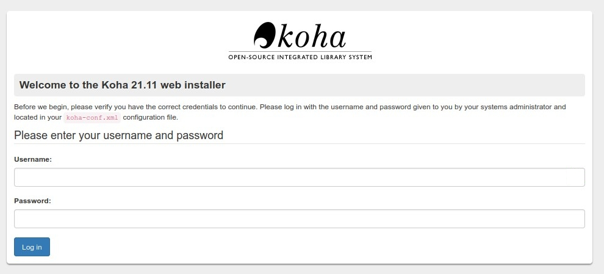
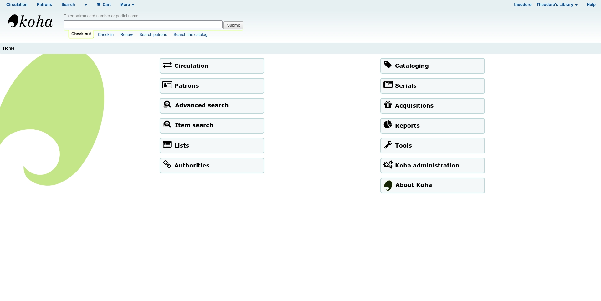
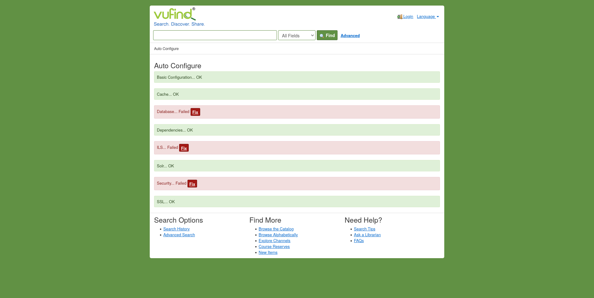
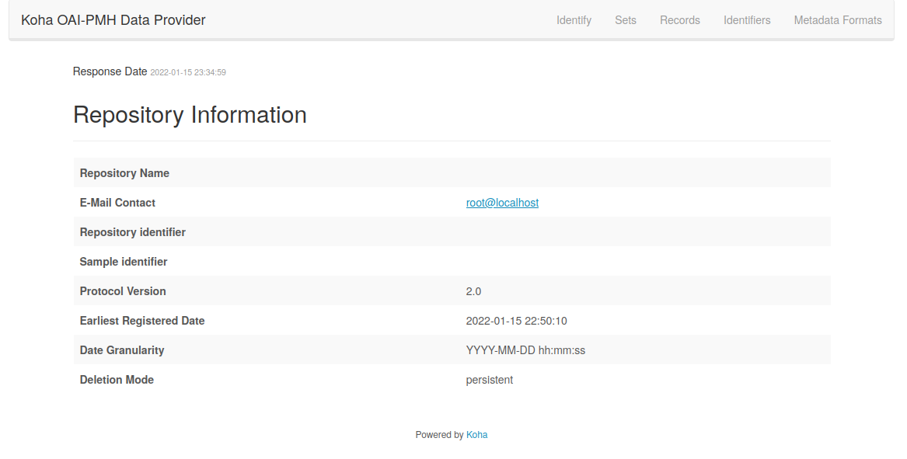
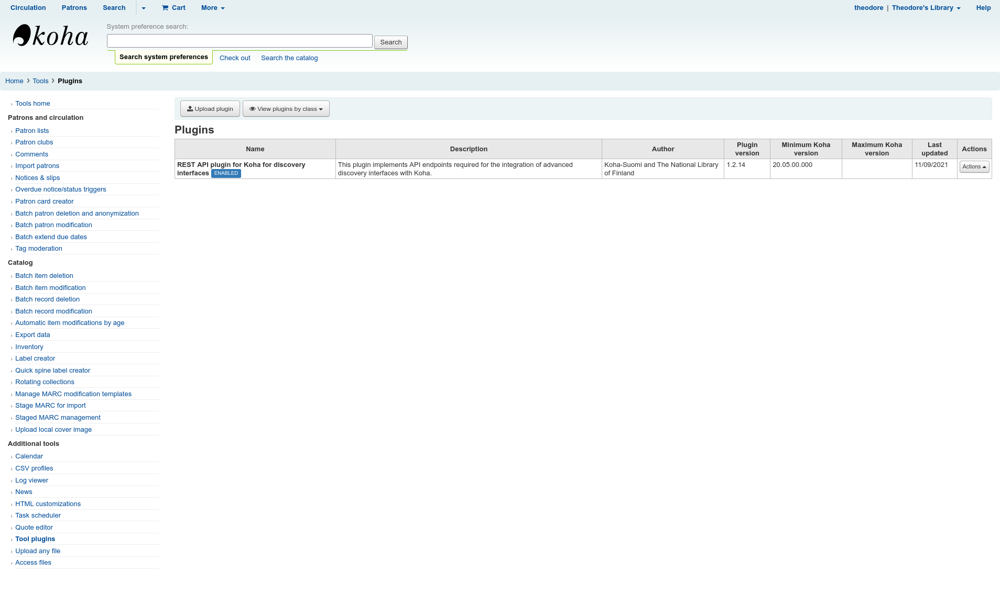
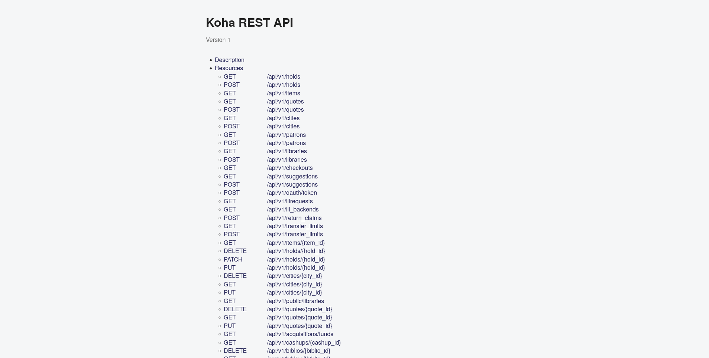
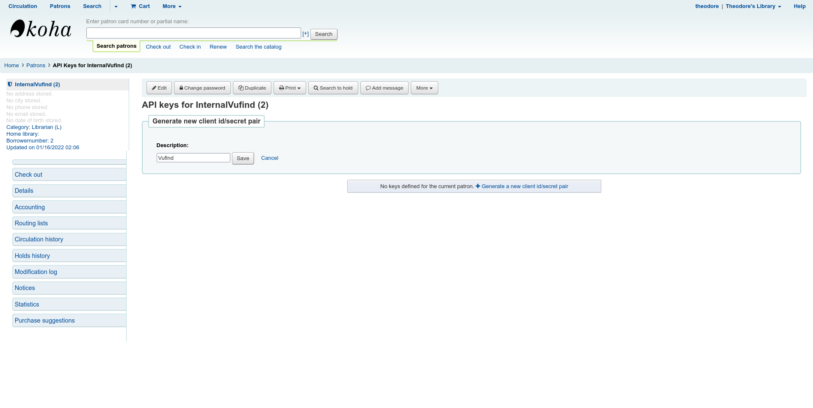

# Koha and Vufind Installation Guide
  
This is a guide on how to install Koha as an ILS (Integrated Library System), along with Vufind as an OPAC (Online Public Access
Catalog).

## Basic info
In this guide I use 3 separate servers. One server for the MariaDB database, used by both systems, one for Koha 
and one for Vufind. This is not necessary and if you want you can install all services on a single server, or distribute them 
however you like.

The operating system used is Debian 11. Both Koha and Vufind provide packages for Debian and
Ubuntu.

I assume that you are already familiar with installing Debian and doing basic configuration tasks.

## Installing the database
To install MariaBD run: ```sudo apt install mariadb-server```. Afterwards make sure you run ```mysql_secure_installation```
to secure your instance.

## Installing and configuring Koha
### Adding the Koha repository and installing packages
First, download the repository keys:


```
wget -q -O- https://debian.koha-community.org/koha/gpg.asc | sudo tee /etc/apt/trusted.gpg.d/koha.asc
```

Then you have to choose if you want to track a specific version of Koha, or a suite. I recommend tracking the stable suite 
as it will automatically keep your system up to date. If you choose a version number, you will stay on that version until 
you manually edit the ```koha.list``` file. This can give you time to test changes if you have a staging environment, for example.

To add the Koha repository tracking the stable suite run:

```
echo 'deb http://debian.koha-community.org/koha stable main' | sudo tee /etc/apt/sources.list.d/koha.list
```
If you want to track a specific version replace ```stable``` with the version number in the above command. As of writing this, 
21.11 is the latest stable version.

After adding the repositories install Koha:

```
sudo apt update
sudo apt install koha-common
```

### Configuring Koha
You can either configure Koha to listen on different ports, or different domains. For more information see 
https://wiki.koha-community.org/wiki/How_to_set_up_a_domain_name_for_Koha and 
https://wiki.koha-community.org/wiki/Koha_on_ubuntu_-_packages#Appendix_A:_Named-based_vs._IP-based_installations.
In this guide I will use a port-based installation.

First, edit the ```/etc/koha/koha-sites.conf``` file using your favourite editor. Edit the options to change the domain and/or 
the ports. In the example below the staff interface is at port 80, while the OPAC is at port 81.

```
INTRAPORT="80"
INTRAPREFIX=""
INTRASUFFIX=""
OPACPORT="81"
OPACPREFIX=""
OPACSUFFIX=""
```
Additionally, you can change the ```ZEBRA_MARC_FORMAT``` and ```ZEBRA_LANGUAGE``` options.

Enable the necessary apache modules:

```
sudo a2enmod rewrite cgi
sudo systemctl restart apache2
```
Add any additional ports you configured above to the ```/etc/apache2/ports.conf``` file. For the example:

```
Listen 80
Listen 81
```
If you use port 80 make sure to delete the default apache site: ```sudo rm /etc/apache2/sites-enabled/000-default.conf```

Restart apache: ```sudo systemctl restart apache2```

#### Creating a library and configuring the database
_If you are running the database on the same machine as Koha you can run_ ```sudo koha-create --create-db libraryname```
_and skip this section._

If you are running the database on a separate machine:

Make sure you have enabled remote connections to your database server by changing the ```bind-address``` option 
of the ```/etc/mysql/mariadb.conf.d/50-server.cnf``` file. For better security, configure a firewall to control access to the port.

Create a new Koha instance by running: 

```sudo koha-create --dbhost <db-server-hostname-or-ip> --request-db libraryname```.
Then read the ```libraryname-db-request.txt``` file.

```
$ cat libraryname-db-request.txt
Please create a MySQL database and user on <database-host> as follows:

database name: koha_libraryname
database user: koha_libraryname
     password: random
```
Connect to the database server and create the database and user with the information in the ```libraryname-db-request.txt``` file.

```
ssh db
user@db:~$ sudo mysql -uroot -p
Enter password: 
Welcome to the MariaDB monitor.  Commands end with ; or \g.
Your MariaDB connection id is 32
Server version: 10.5.12-MariaDB-0+deb11u1 Debian 11

Copyright (c) 2000, 2018, Oracle, MariaDB Corporation Ab and others.

Type 'help;' or '\h' for help. Type '\c' to clear the current input statement.

MariaDB [(none)]> CREATE DATABASE koha_libraryname;
Query OK, 1 row affected (0.000 sec)

MariaDB [(none)]> GRANT ALL PRIVILEGES ON koha_libraryname.* to 'koha_libraryname'@'<koha-server-hostname-or-ip>' IDENTIFIED BY 'random';
Query OK, 0 rows affected (0.006 sec)

MariaDB [(none)]> FLUSH PRIVILEGES;
Query OK, 0 rows affected (0.001 sec)

MariaDB [(none)]> ^DBye

```

Delete the ```/etc/mysql/koha-common.cnf``` file: ```sudo rm /etc/mysql/koha-common.cnf```

Create a new ```/etc/mysql/koha-common.cnf``` file containing the connection information for your database server. For example:

```
[client]
host=db.example.org
user=koha_libraryname
password=random
```

Then run ```sudo koha-create --populate-db libraryname``` to initialize the database.

#### Configuring Plack (optional)
Plack can increase the performance of Koha.

```
sudo a2enmod headers proxy_http
sudo koha-plack --enable libraryname
sudo koha-plack --start libraryname
sudo systemctl restart apache2
```

#### Accessing the web interface
Enable the Web interface: ```sudo koha-enable libraryname```

Access the staff web interface at the port/domain you specified above. For example: ```http://192.168.1.76:80```.

You should come accross the following screen:



The default username is ```koha_libraryname``` and to get the password run ```sudo koha-passwd libraryname```.

Walk through the installer, adjusting the options as you need. For help refer to the [documentation](https://koha-community.org/manual/21.11/en/html/installation.html#web-installer).

After completing the onboarding guide, login with the credentials you provided. Koha should be up and running.



## Installing and configuring Vufind
Connect to the server running Vufind. We will install vufind using the .deb package provided by the project.
The latest version available as of this guide is 8.0.3. If a newer version is available change the url and filename below. 
To download and install Vufind run:

```
cd /tmp
wget https://github.com/vufind-org/vufind/releases/download/v8.0.3/vufind_8.0.3.deb
sudo apt install ./vufind_8.0.3.deb
```

Create a new user to run solr:

```
sudo useradd -r -s /usr/sbin/nologin -U vufind
```

When installing the Vufind package most files will be owned by the user you are currently logged in as. To transfer ownership
to the ```vufind``` user run:

```
sudo find . -user $(whoami) -type f -exec chown vufind:vufind {} \+
sudo find . -user $(whoami) -type d -exec chown vufind:vufind {} \+
```

Increase the process limits, as they can negatively affect performance. Add the following to ```/etc/security/limits.conf```

```
vufind         soft    nproc           65000
vufind         soft    nofile          65000
vufind         hard    nproc           65000
vufind         hard    nofile          65000
```


Start the indexing process:
```
cd /usr/local/vufind/
sudo -u vufind ./solr.sh start
```

You can now start the Vufind setup. Go to ```http://<hostname-or-ip/vufind/Install/Home```

You should be presented with the auto configure screen.



Press Fix next to Basic Configuration and then go back to go to the initial auto configure screen.

### Configuring the database

Press Fix next to Database. Fill out all fields except MySQL Root User and MySQL Root Password. Root remote login 
is dangerous and should be disabled. After filling the form, press the skip button at the bottom. Copy the SQL in the text 
box and save it into a file in the database server, for example ```vufind.sql```. To write the changes to the database 
run:

```
sudo mysql -uroot -p < vufind.sql
```

Find the ```[Database]``` section in ```/usr/local/vufind/local/config/vufind/config.ini``` and fill out the 
database field with the information you typed in the form above. Change the permissions of config.ini so that it 
is not world-readable.

```
sudo chmod 600 /usr/local/vufind/local/config/vufind/config.ini
```

Back in the auto configure page, the ```Database``` entry should be OK. Press the Fix button next to Security. Finally Fix
the ILS and from the dropdown choose the KohaRest driver. Press Submit. You will be presented with an error screen. Do not 
worry, this is normal. We will come back to this later.

### Create systemd service (optional)

Copy the contents into ```/etc/systemd/system/vufind.service```

```
[Unit]
Description=VuFind Starter
After=network.target

[Service]
Type=forking
ExecStart=/bin/sh -l -c '/usr/local/vufind/solr.sh start' -x
PIDFile=/usr/local/vufind/solr/vendor/bin/solr-8983.pid
User=vufind
ExecStop=/bin/sh -l -c "/usr/local/vufind/solr.sh stop" -x
SuccessExitStatus=0
LimitNOFILE=65000
LimitNPROC=65000

[Install]
WantedBy=multi-user.target
```

To automatically start Vufind at boot run: ```sudo systemctl enable vufind.service```

## Harvesting item data from Koha
We are going to be using the OAI-PMH protocol to make importing records from Koha into Vufind easier.

### Enabling OAI-PMH in Koha
Create a configuration file for OAI-PMH, for example at```/etc/koha/koha-oai.conf```, and enter:

```
format:
  vs:
    metadataPrefix: vs
    metadataNamespace: http://veryspecial.tamil.fr/vs/format-pivot/1.1/vs
    schema: http://veryspecial.tamil.fr/vs/format-pivot/1.1/vs.xsd
    xsl_file: /home/koha/Koha/xslt/vs.xsl
  marc21:
    metadataPrefix: marc21
    metadataNamespace: http://www.loc.gov/MARC21/slim http://www.loc.gov/standards/marcxml/schema/MARC21slim
    schema: http://www.loc.gov/MARC21/slim http://www.loc.gov/standards/marcxml/schema/MARC21slim.xsd
    include_items: 1
  marcxml:
    metadataPrefix: marxml
    metadataNamespace: http://www.loc.gov/MARC21/slim http://www.loc.gov/standards/marcxml/schema/MARC21slim
    schema: http://www.loc.gov/MARC21/slim http://www.loc.gov/standards/marcxml/schema/MARC21slim.xsd
    include_items: 1
  oai_dc:
    metadataPrefix: oai_dc
    metadataNamespace: http://www.openarchives.org/OAI/2.0/oai_dc/
    schema: http://www.openarchives.org/OAI/2.0/oai_dc.xsd
    xsl_file: /home/koha/Koha/koha-tmpl/intranet-tmpl/prog/en/xslt/UNIMARCslim2OAIDC.xsl
```

In the Koha staff interface go to: *Home* -> *Koha administration* -> *Global system preferences* -> *Web services* 
and find the OAI-PMH section. Modify the following settings:

* OAI-PMH: Enabled

* OAI-PMH:ConfFile: Enter the location of the file you created previously. In this example ```/etc/koha/koha-oai.conf```

* OAI-PMH:MaxCount: 500

To verify that the server is working go to ```http://<OPAC-ip-or-hostname>/cgi-bin/koha/oai.pl?verb=Identify```


### Importing the data to Vufind
#### Configuration
First you have to set up the field mappings, so that Vufind knows how to get library, section and other information from Koha.

Copy ```marc_local.properties``` to the Vufind local directory:

```
sudo cp /usr/local/vufind/import/marc_local.properties /usr/local/vufind/local/import/
```

Edit the ```/usr/local/vufind/local/import/marc_local.properties``` file and add:

```
collection = 9528
institution = 952b
building = 952c
id = 999c, first
```

This allows Vufind to map the information from the Koha item records (for more configuration options check out 
https://vufind.org/wiki/indexing:koha#vufind_indexing_configuration).
Additionally, you need to configure the OAI-PMH source for Koha.

Copy the sample ```oai.ini``` file into the ```vufind/local``` directory:

```
sudo cp /usr/local/vufind/harvest/oai.ini /usr/local/vufind/local/harvest/
```

Edit the file and add the settings for your Koha server:

```
[Koha]
url=http://<opac-ip-or-hostname>:<opac-port>/cgi-bin/koha/oai.pl
metadataPrefix=marc21
idSearch[]="/^oai:<opac-ip-or-hostname>:<opac-port>:/"
idReplace[]="koha-"
idSearch[]="/\//"
idReplace[]="-"
injectDate="datestamp"
injectId="indentifier"
dateGranularity=auto
combineRecords=true
```

#### Getting the data
Every time you update the records or items in the Koha catalog you have to import the data into Vufind using the following steps.

Run the harvester:

```
cd /usr/local/vufind/local/harvest
sudo -E php /usr/local/vufind/harvest/harvest_oai.php
```

Remove records that have been deleted:

```
cd /usr/local/vufind/local/harvest
sudo -E /usr/local/vufind/harvest/batch-delete.sh Koha
```

Import new records:

```
cd /usr/local/vufind/local/harvest
sudo -E /usr/local/vufind/harvest/batch-import-marc.sh Koha
```

From the documentation: After all deleted and new records have been processed, the records retrieved from the OAI-PMH server 
will have been moved to a “processed” subdirectory of their containing directory. You can periodically clear out this 
directory if you no longer feel you need to retain records. However, it may be useful to keep them, since you can always 
move them back up a directory level and re-run the batch processing scripts in order to reindex everything.

You can automate the following process by creating a shell script and using cron to run it overnight.

## Connecting Vufind with Koha
We have shown how to get item data from Koha into Vufind. In this section we will show how to connect Vufind show it can
show live data from Koha (item location, lending status, holds etc.).

### Enabling the Koha Rest API
#### Installing the plugin
To use the Koha REST API you first have to install a plugin.

To enable plugins on your Koha installation change ```<enable_plugins>0<enable_plugins>``` to ```<enable_plugins>1</enable_plugins>```
in your ```/etc/koha/sites/<libraryname>/koha-conf.xml``` file and restart apache and Koha by running:
```sudo systemctl restart apache2 koha-common```.

Download the latest version of the plugin from https://github.com/NatLibFi/koha-plugin-rest-di/releases .

To install the plugin go to  *Home* -> *Koha administration* -> *Manage plugins*, click the "Upload Plugin" button and select the .kpz 
file you have downloaded. After the install is complete, to enable the plugin, click the "Actions" button on the right and select "Enable".



#### Enabling the API
Go to *Home* -> *Koha administration* -> *Global system preferences* -> *Web services*. Set the ```RESTOAuth2ClientCredentials``` option 
to "Enabled". To verify the API is working go to ```http://<staff-or-opac-ip-or-hostname>/api/v1/.html```.



#### Creating an API user
We will create a new Koha patron that will be exclusively used by Vufind to access our Koha server. Go to the Koha "Patrons"
screen and add a new Patron. Fill out the required fields (may vary depending on your configuration). You can give this patron
a descriptive name. I have chosen ``InternalVufind`` as the surname of the patron. 

After pressing "Save" you will be tranfered to the patron information screen. Press *More* -> *Set permissions*. 
Grant the following permissions to the user:
```
circulate_remaining_permissions
catalogue
borrowers
    edit_borrowers
    view_borrower_infos_from_any_libraries
reserveforothers
    modify_holds_priority
    place_holds
updatecharges
    payout
    remaining_permissions
```
After granting the permissions, press "Save". You will be tranfered to the patron information screen. 

Press *More* -> *Manage API keys* and then *Generate a new client id/secret pair* and give a description for the key 
(e.g. Vufind). The Client ID and secret will be shown. **Copy them now to a safe location.**



### Configuring Vufind
The only thing left is to insert this information to Vufind, so it connects to our Koha server. 

To do that edit the ```/usr/local/vufind/local/config/vufind/KohaRest.ini``` file. Fill out 
the ```host```, ```clientId``` and ```clientSecret``` fields. The comments in the file are pretty explanatory, in 
case you want to, you can adjust more options. After that, checked out status and information from Koha should show up 
in the Vufind web interface. (If all books show up as checked out in the vufind web interface, check out and 
check in a book in Koha. That fixed it for me.)

### Making authentication work
While testing I encountered a strange error. Whenever I queried some API routes added by the plugin I was getting 
a ```501 Not Implemented``` reply. After digging in the logs, I found that I needed to install the ```Email::Valid```
Perl module. To install it run:

```
sudo apt install libemail-valid-perl
```

## Further configuration
So after following this guide the basic functionality of Vufind and Koha should be working.

Recommended actions:
 
* Check out the Koha [Implementation checklist](https://koha-community.org/manual/latest/en/html/implementation_checklist.html) 
to make your library fully functional.
* Review ```/usr/local/vufind/local/config/vufind/config.ini``` and change any options you want. The file is huge and has 
many options, however you should at least change ```email``` and ```title```.
* Configure an SMTP server for Koha, so your patrons can get email notifications.
* If you want patrons to exclusively use Vufind for managing lendings, holds etc. set the PublicOPAC option in Koha to 
disabled. You might not expose it to the internet, but keep it accessible internally as it is required for OAI-PMH to work.

### Enable email
By default, email is turned off. This is to let you get everything set up before you risk sending unwanted notices to people. To turn email on: 

```
sudo koha-email-enable libraryname
```

### Authenticating directly to Koha
The default configuration of Vufind has a separate accounts system. A patron needs to create an account in Vufind and then link 
it to their Koha library account. To allow patrons to log in using their Koha credentials, in the ```config.ini``` file 
under the ```[Authentication]``` section comment out ```method = Database``` and uncomment ```method = ILS```.

### Configuring holds/recalls
By default, Vufind shows holds for all available items. The KohaRest driver supports dynamically fetching wether a hold is 
allowed to be placed on an item or a record. In ```config.ini``` under ```[Catalog]``` set:

```
holds_mode = "driver"
[...]
title_level_holds_mode = "driver"
```

## Troubleshooting
### All books show as checked out in the Vufind web interface
Try checking in and then checking out a book in the Koha staff interface. That worked for me.

### I cannot authenticate using my Koha credentials in Vufind
See [Making authentication work](#making-authentication-work)

### I have encountered a problem in Koha
Koha stores all log files in ```/var/log/koha```.

### I have encountered a problem in Vufind
* Uncomment ```SetEnv VUFIND_ENV development```in ```/etc/apache2/conf-enabled/vufind.conf```. This will display Vufind errors in the 
web interface.
* Enable ```debug = true``` in ```config.ini```. This will display detailed information about ILS driver calls in the web interface.
* Enable logging with the ```file``` option, under the ```[Logging]``` section of the ```config.ini```. The file entered must 
be created first and must be writeable by the user apache is running as.

## Appendix A - Installing Koha on Rocky Linux and Ansible.

If you want to install Koha on Rocky Linux or another distro in general, take a look at [Appendix A](appendix-a-rocky/README.md).
Additionally an Ansible playbook is provided (```install-koha.yaml```), that installs Koha on Rocky Linux (and other RHEL clones)
or openSUSE.

## Appendix B - Koha in a container

A Dockerfile and some notes for running Koha inside a container are provided in the [appendix-b-docker](appendix-b-docker) folder.

## Sources
https://wiki.koha-community.org/wiki/Koha_on_Debian

https://wiki.koha-community.org/wiki/Install_Koha_3.6_on_Debian_squeeze_using_a_separate_MySQL_server

https://vufind.org/wiki/installation:ubuntu

https://vufind.org/wiki/administration:starting_and_stopping_solr

http://www.digital.lib.esn.ac.lk/bitstream/handle/1234/14429/VuFind%20integration%20with%20Koha%20Multiple%20Instances%20Special%20reference%20to%20ILS-DI%20and%20RestAPI.pdf?sequence=1&isAllowed=y

https://tiketti.koha-suomi.fi/projects/koha-suomen-dokumentaatio/wiki/OAI-PMH-configuration

https://github.com/NatLibFi/koha-plugin-rest-di
